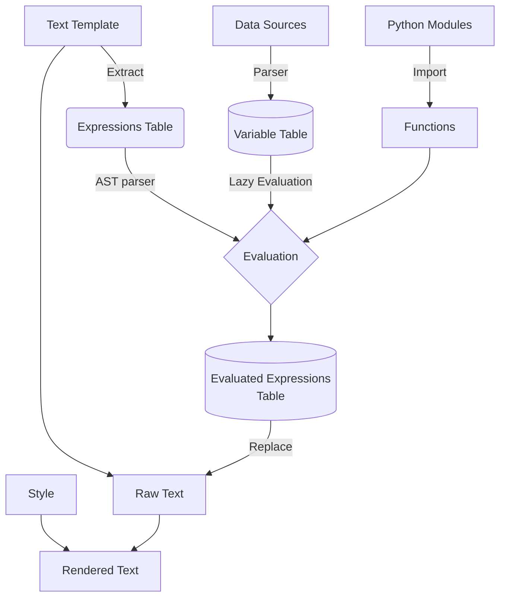

# 报告模板设计方案

随着数据分析需求的日益增长,报告的自动化生成变得越来越重要。本报告详细阐述了一个灵活、高效的报告模板引擎的设计方案。该引擎以 Python 为基础,采用了
Polars 作为主要的数据处理库,使用了 JSON 作为配置和数据交换格式。模板引擎支持从多种渠道获取数据,如数据库和
API,并提供了变量定义、函数调用等功能来增强报告的计算能力。同时,引擎通过声明式语法定义报告组件的模板,并能根据用户规则自动生成 Python
代码。引擎使用文件系统和 REST API
来管理所有模板。从数据获取到模板渲染,整个流程高度自动化,同时保留了灵活性和可扩展性。本报告详细阐述了引擎的核心设计,包括数据流程、变量定义、函数生成、模板语法等关键方面。

## 数据流



1. **数据源**：这是流程的开始，数据源可能包括数据库、API、文件等。数据源通过解析器被转换为变量表。
2. **变量表**：这是一个存储所有从数据源解析出来的变量的表。
3. **文本模板**：这是一个包含多个表达式的文本模板。通过提取操作，我们可以得到表达式表。
4. **表达式表**：这是一个存储文本模板中所有提取出来的表达式的表。这些表达式会被送入 AST 解析器进行解析。
5. **Python模块**：这些是需要导入的 Python 模块，这些模块中包含了一些函数。
6. **函数**：这些是从 Python 模块中导入的函数，它们会被用在表达式的求值过程中。
7. **求值**：这是一个过程，其中 AST 解析器会解析表达式表中的表达式，同时利用变量表和函数进行求值。
8. **求值变量表**：这是一个存储所有已经求值的变量的表。
9. **原始文本**：这是从文本模板中提取出的原始文本，它会和求值变量表一起用于替换操作。
10. **替换**：这是一个过程，其中原始文本中的表达式会被替换为求值变量表中的值。
11. **样式**：这是一个描述如何渲染文本的样式。
12. **渲染文本**：这是最后的结果，原始文本经过替换操作和样式渲染后得到的文本。

首先，数据源经过解析器生成变量表。同时，文本模板中的表达式被提取出来形成表达式表，然后通过 AST 解析器与从 Python 模块中导入的函数以及变量表一起进行求值，得到求值后的变量。原始文本从文本模板中提取出来，然后与求值后的变量一起进行替换操作。最后，经过样式渲染，生成最终的渲染文本。

前端会使用经过求值的 JSON 输出。它将填充好的模板架构映射到交互式的可视化元素。
图表、表格、文本等会根据样式和交互性的需求在屏幕上渲染供最终用户查看。
因为模板需要作为一个完整的对象通过 API 传递给前端，如果不增加额外复杂性，实时更新是不实际的。

要实现实时更新，我们需要考虑如下方法：

- 将模板分解为可以独立更新的较小片段
- 利用 [Websocket](https://en.wikipedia.org/wiki/WebSocket) 或者前端定期轮询来推送增量更新
- 在后端渲染部分的可视化内容并嵌入到前端

然而，所有这些都会增加显著的复杂性。在此场景我们采用：

- 在后端完全对模板进行求值
- 将结果作为完整的 JSON 通过 API 传递给前端
- 前端从静态的 JSON 中渲染出可视化元素


### 变量定义

变量的定义是模板系统的基础。变量可以来源于不同的数据源,比如常量、数据库查询或者表达式计算。同时需要支持各种数据类型,包括基础类型、列表、系列和数据框架。
系统支持从多种渠道获取变量,包括常量、数据库、表达式计算等。同时涵盖各类数据类型,能够满足报告的组织和呈现需要。

- 基础类型 (Primitive Types): 
  - 数字(`int`, `float`)
  - 字符串(`str`)
  - 布尔值(`bool`)
- 容器类型(Collection Types):
  - 列表(`list`)
  - 字典(`dict`) 
  - 元组(`tuple`)
- 数据表类型 (对应 Polars 中的集合类型):
  - 数据表 [(`DataFrame`)](https://pola-rs.github.io/polars/py-polars/html/reference/dataframe/index.html)
  - 序列 [(`Series`)](https://pola-rs.github.io/polars/py-polars/html/reference/series/index.html)

基础类型直接对应Python中的原生类型。
列表 (`list`) 对应 Python 中的 List 和 JavaScript 中的 `Array`, 一般用于同构的数据集合。
序列 (`Series`) 对应 Polars 中的 `Series` 类型,用于存储单一类型数据的序列。
数据表 (`DataFrame`) 对应 Polars 中的 `DataFrame` 类型,用于存储多列异构数据。每列需要定义名称和类型。

- 派生类型 (Derived Types)
  - `datetime` 日期时间类型,存储符合 ISO 8601 标准的日期时间字符串. 如: `2023-02-15T09:30:00Z` 在模板渲染时会自动转换为 Python 的 [`datetime`](https://docs.python.org/3/library/datetime.html) 对象,可以进行日期时间的运算和格式化。
  - `any` 动态类型,可以保存任意类型的数据,不做运行时检查。

理论上来说任何 Python 类型都可以作为变量的类型, 但上述类型应该被优先使用, 避免与 Python 原生类型混淆。

在模板系统中，[agronholm/typeguard](https://github.com/agronholm/typeguard)
库可以被用来确保数据类型的准确性。 这个库提供了对使用 [PEP 484](https://peps.python.org/pep-0484/)
注解定义的函数的运行时类型检查，以及对任意对象的类型检查。它可以与静态类型检查器一起使用，作为额外的类型安全层，用以捕获只能在运行时被侦测到的类型违规行为。
当模板系统在运行时处理并操作变量（可能来自不同的数据源，如常量、数据库查询或者表达式计算）时，提供额外的类型检查层，确保数据类型与预期相符，防止可能出现的类型违规或错误。这样，无论是在处理单一类型的数据，还是在操作复杂的数据结构（如列表、系列或数据框架）时，都能为保证模板系统的正常进行处理或异常捕获。

### 数据源

模板系统支持从多种数据源获取变量,常见的数据源包括:

- 常量 (`Constants`)  直接在模板中定义常量值,如字符串、数字等。
- 数据库 (`Database`) 通过数据库查询获取结果集作为变量,可以是 SQL、NoSQL等数据库。
- API  (`API`) 调用外部 API 接口获取 JSON、XML等格式的数据作为变量。
- 文件 (`Files`) 从 CSV、Excel、JSON 等文件中加载数据作为变量。用户需要描述对应列的名称和类型。

通过支持各种数据源,模板系统可以灵活获取报告所需的动态数据,组织生成报告。同时也可以方便地与外部系统集成,构建自动化的数据分析流程。 在此以 API 数据源为例

```json
[
  {
      "operations": {
          "type": "api",
          "url": "http://localhost:3306/api",
          "parameters": [
              {
                  "field": "operateList",
                  "query": "SELECT * FROM Operations"
              },
              {
                  "field": "patientInfo",
                  "query": "SELECT * FROM Patients WHERE patientId = 123"
              },
              {
                  "field": "visitRecords",
                  "query": "SELECT * FROM Visits WHERE patientId = 123 ORDER BY visitDate DESC"
              },
              {
                  "field": "diagnoses",
                  "query": "SELECT * FROM Diagnoses WHERE patientId = 123"
              }
          ]
      }
  }
]
```

该数据源描述一个 API 接口,通过调用该接口获取数据。
接口返回的数据是一个 JSON 对象,其中包含了多个字段,每个字段对应一个查询结果。
每个查询结果都是一个 JSON 数组,其中每个元素是一个 JSON 对象,表示一条记录。

### 变量表

在内部计算时不会直接使用数据源中的数据, 而是将其转换为变量表, 只有在变量表中的
变量才会被模板求值器使用。变量表是一个 JSON 对象, 其中每个键值对对应一个变量。

```json
[
    {
        "name": "date",
        "type": "list[datetime]",
        "verifier": "lambda x: all(isinstance(i, datetime.date) for i in x) if isinstance(x, list) else False",
        "json-path": "$.operateList[*].total",
        "postprocess": "lambda coll: [datetime.datetime.strptime(i, '%Y-%m-%d').date() for i in coll]",
        "formatter": "lambda x: ', '.join(date.strftime('%Y-%m-%d') for date in x)",
        "source": "patient",
        "comment": "报告的日期"
    }
]
```

- `"name"`: 这个键存储了变量的名称。在此例中，变量的名称为 `"date"`。
- `"type"`: 这个键描述了变量的数据类型。在此例中，变量 "date" 的类型是 `list[datetime]`, 运行时类型检查库会验证变量的值是否符合这个类型的定义。
- `"verifier"`: 这是一个函数（在这个示例中，它是一个 lambda 函数），用于验证变量的值是否符合预期的数据类型。该函数接受一个参数，返回一个布尔值。如果传入的参数符合预期的数据类型，函数就返回 `True`；否则，返回 `False`。
- `"json-path"`: 这个键存储了一个 JSONPath 表达式，这个表达式定义了在 JSON 数据中如何定位到这个变量的值。
- `"postprocess"`: 这是一个函数（在这个例子中，它也是一个 lambda 函数），用于后处理变量的值。这个函数接受一个参数，返回一个处理后的值。在这个例子中，这个函数将字符串转换为日期对象。
- `"source"`: 这个键描述了这个变量的来源。在此例中，来源是 `"patient"`。
- `"formatter"`: 这是一个函数（在这个例子中，它也是一个 lambda 函数），用于格式化变量的值。这个函数接受一个参数，返回一个字符串。在这个例子中，这个函数将日期对象转换为字符串。
- `"comment"`: 这个键存储了关于这个变量的一些额外注释或者描述。在此例中，注释是 "报告的日期"，说明这个变量代表的是报告的日期。

值得注意的是变量表中的变量应该是 [惰性求值 (Lazy Evaluation)](https://zh.wikipedia.org/wiki/惰性求值) 的, 即仅当变量被表达式引用时才进行求值。避免不必要的计算,减少资源消耗。

### 模块与函数

模板中的表达式所调用的函数需要通过 `import` 导入, 就像一个普通的 Python 脚本一般

```json
{
  "imports": [
    "import math",
    "import numpy as np",
    "import pandas as pd",
    "import polars as pl",
    "from datetime import datetime",
  ]
}
```

### 文本模板

文本模板是一个包含多个表达式的文本。表达式由 `${}` 包裹起来。表达式中可以包含变量、函数调用、运算符等。

```json
{
  "content": [
    {
      "tagName": "p",
      "text": "本期中出院病例${num_patient}例。手术人数${num_operation}人，四级手术${num_operation_4}人，微创手术${num_operation_micro}人。CMI值${CMI}，其中 CMI 小于1的病人数有${query(CMI<1)}人，占比${query(CMI<1)/num_patient}；1-2的病人数${query(CMI > 1 && CMI < 2)}人，占比${query(CMI > 1 && CMI < 2) / num_patient};2-5的病人数${num_CIM_2_5 := query(CMI > 2 && CMI < 5)}人，占比${num_CIM_2_5 / num_patient};大于5的病人数${num_CIM_gt_5 := query(CMI > 5)}人,占比${num_CIM_gt_5 / num_patient}。总体来说大于2的病人数${num_CIM_gt_2 := query(CMI > 2)}人，占比${num_CIM_gt_2 / num_patient}%，有提升空间。"
    },
  ]
}
```

解析器会将所有的表达式从文本模板中提取出来，并将它们转换为表达式表。

```json
{
  "c7a7d524": "num_patient",
  "39671c0e": "num_operation", 
  "627c4614": "num_operation_4",
  "23563a08": "num_operation_micro",
  "f273a4e5": "CMI",
  "b1437de9": "query(CMI<1)",
  "c3f99b64": "query(CMI<1)/num_patient",
  "78b12458": "query(CMI > 1 && CMI < 2)",
  "a5c3e6f2": "query(CMI > 1 && CMI < 2) / num_patient",
  "9d7a33b1": "num_CIM_2_5 := query(CMI > 2 && CMI < 5)",
  "6ba71d22": "num_CIM_2_5 / num_patient",
  "5f26985c": "num_CIM_gt_5 := query(CMI > 5)",
  "c8e56094": "num_CIM_gt_5 / num_patient",
  "4b3a6d03": "num_CIM_gt_2 := query(CMI > 2)", 
  "d2f6e507": "num_CIM_gt_2 / num_patient"
}
```

在这个表达式表中, 键是表达式的[哈希](https://zh.wikipedia.org/zh-hans/散列函數)，它们将在后续的替换操作中用来匹配原始文本中的表达式。而值则是原始的表达式。
解析器还可能负责检查这些表达式的语法是否正确，例如，检查括号是否匹配，或者检查变量名是否有效等。
在这个过程完成之后，表达式表就可以送入下一个步骤——AST解析器进行进一步的解析和求值。

对于图表和表格等可视化组件,我们可以使用类似的方式来定义模板。
例如，一个模板可能定义了一个图表和一个表格：

```json
{
  "type": "report",
  "chart": {
    "type": "bar",
    "x": "${month}", 
    "y": "${revenue}"
  },
  "table": {
    "columns": [
      {"label": "月份", "field": "${month}"},
      {"label": "收入", "field": "${revenue}"} 
    ]
  }
}
```

这个模板声明了输出格式，但其中引用的 `${expressions}` 需要被求值。

当将模板中的表达式进行求值后，我们会得到以下的 JSON 输出：

```json
{
  "type": "report",
  "chart": {
    "type": "bar",
    "x": ["一月", "二月", "三月", "四月"], 
    "y": [2000, 3000, 2500, 3500]
  },
  "table": {
    "columns": [
      {"label": "月份", "field": ["一月", "二月", "三月", "四月"]},
      {"label": "收入", "field": [2000, 3000, 2500, 3500]} 
    ]
  }
}
```

在这个例子中，`${month}` 和 `${revenue}` 已经被实际的数据数组替换。`"x"` 和 `"field"` 对应 "月份" 的数据是四个月份名，`"y"` 和另一个 `"field"` 对应 "收入" 的数据是每个月的收入数字。这样得到的 JSON 输出就可以用于生成报告中的条形图和表格。

## 函数生成

用户可以采用像 JSON 这样的声明式格式定义一组[筛选 (filter)](https://pola-rs.github.io/polars/py-polars/html/reference/dataframe/api/polars.DataFrame.filter.html)/ [汇总 (aggregation)](https://pola-rs.github.io/polars/py-polars/html/reference/dataframe/aggregation.html)规则。然后，这些规则被解析并转化为 Python 代码。
生成的 Python 函数将被添加到函数表中，供模板求值器调用，并传入一个
`DataFrame`。这个函数会根据定义的规则对数据进行筛选/汇总操作，最后将结果添加到变量表中。
这种方式的好处是，用户只需声明规则，即可生成优化的 Python
代码，实现复杂的数据转换，并可在模板中重复使用函数。

前端可以通过交互界面来定义规则，然后将规则转换为 JSON 格式，通过 API 在后端生成对应的 Python 函数. 如以下简单的例子

```json
{
  "name": "average_income_by_region",
  "source": "employee_data",
  "pipeline": [
    {
      "operation": "filter",
      "arguments": [
        {
          "function": "and",
          "arguments": [
            {
              "function": "gte",
              "arguments": ["age", 18]
            },
            {
              "function": "eq",
              "arguments": ["job_status", "FULL_TIME"]
            }
          ]
        }
      ]
    },
    {
      "operation": "groupby",
      "arguments": ["region"]
    },
    {
      "operation": "mean",
      "arguments": ["income"]
    }
  ],
  "type": "DataFrame"
}
```

生成的 Python 代码

```python
import polars as pl

def calculate_average_income_by_region(df):
    """
    对给定的 DataFrame 进行一系列操作，包括过滤、分组和计算平均值。

    参数:
    df (pl.DataFrame): 输入的 DataFrame。应包含 "age", "job_status", "region", 和 "income" 列。

    返回:
    pl.DataFrame: 返回一个 DataFrame，其中包含 "region" 和 "average_income_by_region" 列。
    """
    # 根据条件过滤行
    # 根据 "region" 列进行分组，并计算 "income" 的平均值
    df = df.filter((pl.col("age") >= 18) & (pl.col("job_status") == "FULL_TIME"))
           .groupby("region").agg(pl.col("income").mean().alias("average_income_by_region"))

    return df
```

这种基于 JSON 规则生成 Python 函数的方法可以极大地简化用户的操作流程。用户无需手动编写代码或者直接生成
JSON，只需要通过前端提供的交互界面进行操作即可。
这种方法将复杂的数据处理过程隐藏在背后，用户只需关注自身的需求和操作，使得数据操作更加直观和易用，大大提高了用户体验。

### 样式

采用类似 CSS 的样式描述

```json
{
  "style": {
    "h1": {
      "font-size": "20px",
      "color": "blue"
    },
    "p": {
      "font-size": "14px"  
    }
  },

  "content": [
    {
      "tagName": "h1",
      "text": "Hello World"     
    },
    {
      "tagName": "p", 
      "text": "Here is some text"
    }
  ]
}
```

这样的模板设计提供了一种直观、简洁且灵活的样式管理方式。通过将样式嵌入到 JSON
中，可以方便地为每个组件或元素定义独特的样式，增强了代码的可读性和可维护性。
同时，该设计方法可以实现 CSS 的模块化，更好地管理和组织样式代码，使其更易于理解和复用。


## 模板存储

模板的文本内容可以直接存储在关系型数据库或者文档数据库中。但在这里我们选择直接使用文件存储来管理模板. 以下是
其 RESTful API 的设计:

1. **`GET /template`**：此端点列出 `template-path` 目录中的所有 JSON 模板。它通过列出目录中的所有文件，过滤出 JSON 文件，然后在返回列表前删除文件扩展名来实现这一点。
2. **`GET /template/:name`**：此端点通过名称检索特定模板。从 URL 路径参数中获取的名称用于构造 JSON 文件的文件路径。如果文件存在并且是 JSON 文件，它将被读取并返回内容。如果文件不存在或不是 JSON 文件，则返回错误。
3. **`POST /template/:name`**：此端点创建新模板。请求体预期为一个 JSON 对象，该对象将写入 `template-path` 目录中的新文件。文件名由 `:name` 路径参数导出。如果已存在同名文件，则返回错误。
4. **`DELETE /template/:name`**：此端点删除特定模板。使用 `:name` 路径参数构造 JSON 文件的文件路径。如果文件存在并且是 JSON 文件，则删除它。如果文件不存在或不是 JSON 文件，则返回错误。

其正式接口将使用 [Swagger](https://swagger.io/) 或 [OpenAPI](https://www.openapis.org/) 规范来定义。
亦可为模版添加添加版本控制功能, 以维护修改历史, 支持回滚模版到任意版本。

## 用户界面


- 页面分为两个主要部分：左侧的代码编辑器和右侧的结果展示器。
- 左侧的代码编辑器可以由一个或多个卡片（或称为单元格）组成。每个卡片都可以包含一段代码，用户可以在其中输入、编辑和删除代码。卡片可以通过点击添加和删除按钮来创建和移除，用户可以自由地调整卡片的顺序。每个卡片还可以包含一些样式选项，比如字体大小和颜色，使用户能够根据自己的喜好定制代码的显示样式。
- 右侧的结果展示器负责渲染和显示左侧代码卡片中的代码的运行结果。每当用户在某个卡片中运行代码时，这个卡片的结果就会在右侧的相应位置显示出来。结果可以以各种形式展现，包括但不限于：纯文本、表格、图像和交互式图表。
- 两侧的面板中间有一个可调整的分隔线，用户可以通过拖动分隔线来调整两侧面板的宽度。
- 整个用户界面设计遵循响应式设计原则，使得布局和组件能够根据浏览器窗口的尺寸自适应调整。

具体前端技术栈的选择, 我们将采用 [TypeScript](https://www.typescriptlang.org)
作为主要的编程语言，由于其强大的静态类型检查功能，能够显著提高代码的健壮性和可维护性。 作为用户界面的构建框架，我们选择了
[Svelte](https://svelte.dev)，它以其编译时优化的特性，为我们的应用提供了高效的运行性能和简洁的代码结构。 表格展示方面，我们选用了
[ag-Grid](https://www.ag-grid.com) ，这是一个功能丰富且性能出色的数据网格库，可以满足我们对复杂表格处理的需求。
在数据可视化部分，我们选择了 [Apache
ECharts](https://echarts.apache.org/en/index.html)，这是一款由Apache基金会支持的开源图表库，拥有丰富的图表类型和强大的定制能力，能够帮助我们创建出各种动态交互的数据视图。
最后，我们选用了 [Tailwind CSS](https://tailwindcss.com)
来处理样式和布局，它是一个功能类优先的CSS框架，能让我们通过组合预定义的样式类，快速地构建和修改用户界面。

## 总结

本设计方案展示了一个全面的报告模板引擎，其设计目标是实现高度灵活且用户友好的报告生成。方案支持多种数据源，允许变量定义与自定义处理，提供函数调用功能以增强计算能力，同时采用声明式语法定义文本和组件模板。引擎还能根据用户设定的规则自动生成
Python 代码，并通过文件系统和 REST
API 管理模板存储。总体而言，本方案旨在提供一个完全可定制、易于使用的报告生成解决方案。
