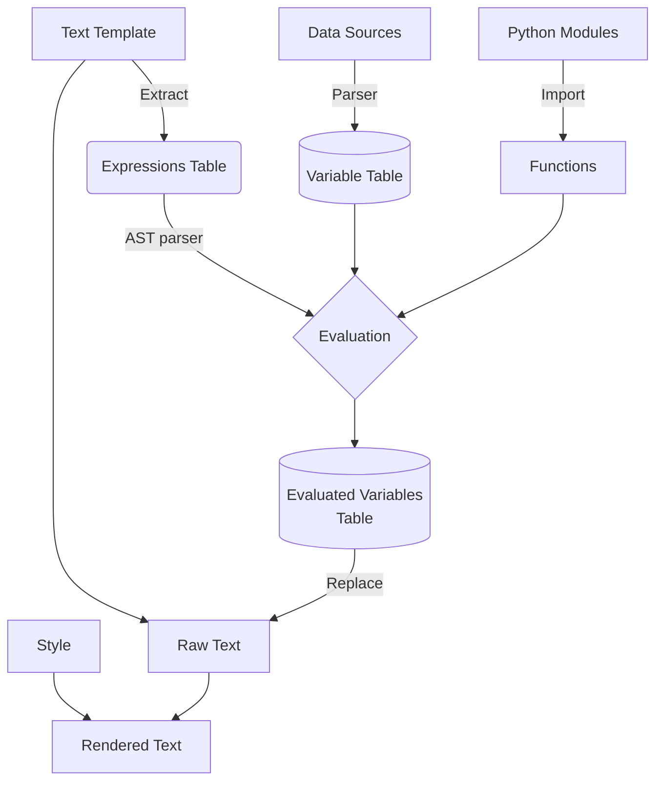

# 报告模板设计方案

本设计方案旨在构建一个报告生成的模板系统。考虑到业务需求,我们需要重新设计一个定制化程度高的模板引擎。

## 数据流



1. **数据源**：这是流程的开始，数据源可能包括数据库、API、文件等。数据源通过解析器被转换为变量表。
2. **变量表**：这是一个存储所有从数据源解析出来的变量的表。
3. **文本模板**：这是一个包含多个表达式的文本模板。通过提取操作，我们可以得到表达式表。
4. **表达式表**：这是一个存储文本模板中所有提取出来的表达式的表。这些表达式会被送入 AST 解析器进行解析。
5. **Python模块**：这些是需要导入的 Python 模块，这些模块中包含了一些函数。
6. **函数**：这些是从 Python 模块中导入的函数，它们会被用在表达式的求值过程中。
7. **求值**：这是一个过程，其中 AST 解析器会解析表达式表中的表达式，同时利用变量表和函数进行求值。
8. **求值变量表**：这是一个存储所有已经求值的变量的表。
9. **原始文本**：这是从文本模板中提取出的原始文本，它会和求值变量表一起用于替换操作。
10. **替换**：这是一个过程，其中原始文本中的表达式会被替换为求值变量表中的值。
11. **样式**：这是一个描述如何渲染文本的样式。
12. **渲染文本**：这是最后的结果，原始文本经过替换操作和样式渲染后得到的文本。

首先，数据源经过解析器生成变量表。同时，文本模板中的表达式被提取出来形成表达式表，然后通过 AST 解析器与从 Python 模块中导入的函数以及变量表一起进行求值，得到求值后的变量。原始文本从文本模板中提取出来，然后与求值后的变量一起进行替换操作。最后，经过样式渲染，生成最终的渲染文本。

前端会使用经过求值的 JSON 输出。它将填充好的模板架构映射到交互式的可视化元素。
图表、表格、文本等会根据样式和交互性的需求在屏幕上渲染供最终用户查看。
因为模板需要作为一个完整的对象通过 API 传递给前端，如果不增加额外复杂性，实时更新是不实际的。

要实现实时更新，我们需要考虑如下方法：

- 将模板分解为可以独立更新的较小片段
- 利用 Websocket 或者前端定期轮询来推送增量更新
- 在后端渲染部分的可视化内容并嵌入到前端

然而，所有这些都会增加显著的复杂性。在此场景我们采用：

- 在后端完全对模板进行求值
- 将结果作为完整的 JSON 通过 API 传递给前端
- 前端从静态的 JSON 中渲染出可视化元素


### 变量定义

变量的定义是模板系统的基础。变量可以来源于不同的数据源,比如常量、数据库查询或者表达式计算。同时需要支持各种数据类型,包括基础类型、列表、系列和数据框架。
系统支持从多种渠道获取变量,包括常量、数据库、表达式计算等。同时涵盖各类数据类型,能够满足报告的组织和呈现需要。

- 基础类型(Primitive Types): 
  - 数字(int, float)
  - 字符串(str)
  - 布尔值(bool)
- 容器类型(Collection Types):
  - 列表(list)
  - 字典(dict) 
  - 元组(tuple)
- 数据表类型 (对应 Polars 中的集合类型):
  - 数据表(DataFrame) 
  - 序列(Series)

基础类型直接对应Python中的原生类型。
列表 (list) 对应 Python 中的 List 和 JavaScript 中的 Array,一般用于同构的数据集合。
序列 (Series) 对应 Polars 中的 Series 类型,用于存储单一类型数据的序列。不应该支持嵌套的 Series。
数据表 (DataFrame) 对应 Polars 中的 DataFrame 类型,用于存储多列异构数据。每列需要定义名称和类型。

整体来说,模板系统的变量类型覆盖了绝大多数报告的需求,既保证了通用性,也提供了必要的专用类型,为报告的组织和呈现提供了支持。


- 派生类型 (Derived Types)
  - `datetime` 日期时间类型,存储符合 ISO 8601 标准的日期时间字符串. 如: `2023-02-15T09:30:00Z` 在模板渲染时会自动转换为 Python 的 datetime 对象,可以进行日期时间的运算和格式化。
  - `any` 动态类型,可以保存任意类型的数据,不做运行时检查。


在模板系统中，[agronholm/typeguard](https://github.com/agronholm/typeguard) 库可以被用来确保数据类型的准确性。
这个库提供了对使用 [PEP 484](https://peps.python.org/pep-0484/) 注解定义的函数的运行时类型检查，以及对任意对象的类型检查。它可以与静态类型检查器一起使用，作为额外的类型安全层，用以捕获只能在运行时被侦测到的类型违规行为。
当模板系统在运行时处理并操作变量（可能来自不同的数据源，如常量、数据库查询或者表达式计算）时，提供额外的类型检查层，确保数据类型与预期相符，防止可能出现的类型违规或错误。这样，无论是在处理单一类型的数据，还是在操作复杂的数据结构（如列表、系列或数据框架）时，都能为保证模板系统的正常进行处理或异常捕获。

### 数据源

模板系统支持从多种数据源获取变量,常见的数据源包括:

- 常量(Constants)  直接在模板中定义常量值,如字符串、数字等。
- 数据库 (Database) 通过数据库查询获取结果集作为变量,可以是 SQL、NoSQL等数据库。
- API接口 (API) 调用外部 API 接口获取 JSON、XML等格式的数据作为变量。
- 文件 (Files) 从 CSV、Excel、JSON 等文件中加载数据作为变量。

通过支持各种数据源,模板系统可以灵活获取报告所需的动态数据,组织生成报告。同时也可以方便地与外部系统集成,构建自动化的数据分析流程。
以 API 数据源为例.

```json
[
  {
      "operations": {
          "type": "api",
          "url": "http://localhost:3306/api",
          "parameters": [
              {
                  "field": "operateList",
                  "query": "SELECT * FROM Operations"
              },
              {
                  "field": "patientInfo",
                  "query": "SELECT * FROM Patients WHERE patientId = 123"
              },
              {
                  "field": "visitRecords",
                  "query": "SELECT * FROM Visits WHERE patientId = 123 ORDER BY visitDate DESC"
              },
              {
                  "field": "diagnoses",
                  "query": "SELECT * FROM Diagnoses WHERE patientId = 123"
              }
          ]
      }
  }
]
```

该数据源描述一个 API 接口,通过调用该接口获取数据。
接口返回的数据是一个 JSON 对象,其中包含了多个字段,每个字段对应一个查询结果。
每个查询结果都是一个 JSON 数组,其中每个元素是一个 JSON 对象,表示一条记录。

### 变量表

```json
[
    {
        "name": "date",
        "type": "list[datetime]",
        "verifier": "lambda x: all(isinstance(i, datetime.date) for i in x) if isinstance(x, list) else False",
        "json-path": "$.operateList[*].total",
        "postprocess": "lambda coll: [datetime.datetime.strptime(i, '%Y-%m-%d').date() for i in coll]",
        "formatter": "lambda x: ', '.join(date.strftime('%Y-%m-%d') for date in x)",
        "source": "patient",
        "comment": "报告的日期"
    }
]
```

- `"name"`: 这个键存储了变量的名称。在此例中，变量的名称为 "date"。
- `"type"`: 这个键描述了变量的数据类型。在此例中，变量 "date" 的类型是 `list[datetime]`, 运行时类型检查库会验证变量的值是否符合这个类型的定义。
- `"verifier"`: 这是一个函数（在这个示例中，它是一个 lambda 函数），用于验证变量的值是否符合预期的数据类型。该函数接受一个参数，返回一个布尔值。如果传入的参数符合预期的数据类型，函数就返回 `True`；否则，返回 `False`。
- `"json-path"`: 这个键存储了一个 JSONPath 表达式，这个表达式定义了在 JSON 数据中如何定位到这个变量的值。
- `"postprocess"`: 这是一个函数（在这个例子中，它也是一个 lambda 函数），用于后处理变量的值。这个函数接受一个参数，返回一个处理后的值。在这个例子中，这个函数将字符串转换为日期对象。
- `"source"`: 这个键描述了这个变量的来源。在此例中，来源是 "patient"。
- `"formatter"`: 这是一个函数（在这个例子中，它也是一个 lambda 函数），用于格式化变量的值。这个函数接受一个参数，返回一个字符串。在这个例子中，这个函数将日期对象转换为字符串。
- `"comment"`: 这个键存储了关于这个变量的一些额外注释或者描述。在此例中，注释是 "报告的日期"，说明这个变量代表的是报告的日期。

### 模块与函数

模板中的表达式所调用的函数需要通过 `import` 导入, 就像一个普通的 Python 脚本一般

```json
{
  "imports": [
    "import math",
    "import numpy as np",
    "import pandas as pd",
    "import polars as pl",
    "from datetime import datetime",
  ]
}
```

### 文本模板

文本模板是一个包含多个表达式的文本。表达式由 `${}` 包裹起来。表达式中可以包含变量、函数调用、运算符等。

```json
{
  "content": [
    {
      "tagName": "p",
      "text": "本期中出院病例${num_patient}例。手术人数${num_operation}人，四级手术${num_operation_4}人，微创手术${num_operation_micro}人。CMI值${CMI}，其中 CMI 小于1的病人数有${query(CMI<1)}人，占比${query(CMI<1)/num_patient}；1-2的病人数${query(CMI > 1 && CMI < 2)}人，占比${query(CMI > 1 && CMI < 2) / num_patient};2-5的病人数${num_CIM_2_5 := query(CMI > 2 && CMI < 5)}人，占比${num_CIM_2_5 / num_patient};大于5的病人数${num_CIM_gt_5 := query(CMI > 5)}人,占比${num_CIM_gt_5 / num_patient}。总体来说大于2的病人数${num_CIM_gt_2 := query(CMI > 2)}人，占比${num_CIM_gt_2 / num_patient}%，有提升空间。"
    },
  ]
}
```

解析器会将所有的表达式从文本模板中提取出来，并将它们转换为表达式表。

```json
{
  "expr1": "num_patient",
  "expr2": "num_operation",
  "expr3": "num_operation_4",
  "expr4": "num_operation_micro",
  "expr5": "CMI",
  "expr6": "query(CMI<1)",
  "expr7": "query(CMI<1)/num_patient",
  "expr8": "query(CMI > 1 && CMI < 2)",
  "expr9": "query(CMI > 1 && CMI < 2) / num_patient",
  "expr10": "num_CIM_2_5 := query(CMI > 2 && CMI < 5)",
  "expr11": "num_CIM_2_5 / num_patient",
  "expr12": "num_CIM_gt_5 := query(CMI > 5)",
  "expr13": "num_CIM_gt_5 / num_patient",
  "expr14": "num_CIM_gt_2 := query(CMI > 2)",
  "expr15": "num_CIM_gt_2 / num_patient"
}
```

在这个表达式表中，`expr1` 到 `expr15` 是随机生成的键，它们将在后续的替换操作中用来匹配原始文本中的表达式。而值则是原始的表达式。
解析器还可能负责检查这些表达式的语法是否正确，例如，检查括号是否匹配，或者检查变量名是否有效等。
在这个过程完成之后，表达式表就可以送入下一个步骤——AST解析器进行进一步的解析和求值。

对于图表和表格等可视化组件,我们可以使用类似的方式来定义模板。
例如，一个模板可能定义了一个图表和一个表格：

```json
{
  "type": "report",
  "chart": {
    "type": "bar",
    "x": "${month}", 
    "y": "${revenue}"
  },
  "table": {
    "columns": [
      {"label": "月份", "field": "${month}"},
      {"label": "收入", "field": "${revenue}"} 
    ]
  }
}
```

这个模板声明了输出格式，但其中引用的 `${expressions}` 需要被求值。

当将模板中的表达式进行求值后，我们会得到以下的 JSON 输出：

```json
{
  "type": "report",
  "chart": {
    "type": "bar",
    "x": ["January", "February", "March", "April"], 
    "y": [2000, 3000, 2500, 3500]
  },
  "table": {
    "columns": [
      {"label": "月份", "field": ["January", "February", "March", "April"]},
      {"label": "收入", "field": [2000, 3000, 2500, 3500]} 
    ]
  }
}
```

在这个例子中，`${month}` 和 `${revenue}` 已经被实际的数据数组替换。"x" 和 "field" 对应 "月份" 的数据是四个月份名，"y" 和另一个 "field" 对应 "收入" 的数据是每个月的收入数字。这样得到的 JSON 输出就可以用于生成报告中的条形图和表格。

## 函数生成

用户可以采用像 JSON 这样的声明式格式定义一组筛选/汇总规则。然后，这些规则被解析并转化为 Python 代码。
生成的 Python 函数将被添加到函数表中，供模板求值器调用，并传入一个
DataFrame。这个函数会根据定义的规则对数据进行筛选/汇总操作，最后将结果添加到变量表中。
这种方式的好处是，用户只需声明规则，即可生成优化的 Python
代码，实现复杂的数据转换，并可在模板中重复使用函数。

如以下简单的例子

```json
{
  "name": "calculate_tax",
  "source": "income_data",
  "rules": [
    {
      "operation": "apply",
      "arguments": [
        {
          "function": "tax_function",
          "arguments": ["income", "tax_rate"]
        }
      ]
    }
  ],
  "type": "Series[float]"
}
```

生成的 Python 代码

```python
import polars as pl

# 假设 "income_data" DataFrame 和 "tax_function" 已经定义
df = income_data

# 用 tax_function 来计算税
df = df.with_column(pl.col("income").apply(tax_function, args=("income", "tax_rate")))

# 结果是一个类型为 float 的 Series
result = df["calculate_tax"]
```

这种基于 JSON 规则生成 Python 函数的方法可以极大地简化用户的操作流程。用户无需手动编写代码或者直接生成
JSON，只需要通过前端提供的交互界面进行操作即可。
这种方法将复杂的数据处理过程隐藏在背后，用户只需关注自身的需求和操作，使得数据操作更加直观和易用，大大提高了用户体验。

### 样式

采用类似 CSS 的样式描述

```json
{
  "style": {
    "h1": {
      "font-size": "20px",
      "color": "blue"
    },
    "p": {
      "font-size": "14px"  
    }
  },

  "content": [
    {
      "tagName": "h1",
      "text": "Hello World"     
    },
    {
      "tagName": "p", 
      "text": "Here is some text"
    }
  ]
}
```

这样的模板设计提供了一种直观、简洁且灵活的样式管理方式。通过将样式嵌入到 JSON
中，可以方便地为每个组件或元素定义独特的样式，增强了代码的可读性和可维护性。
同时，该设计方法可以实现 CSS 的模块化，更好地管理和组织样式代码，使其更易于理解和复用。


## 模板存储

模板的文本内容可以直接存储在关系型数据库或者文档数据库中。但在这里我们选择直接使用文件存储来管理模板. 以下是
其 RESTful API 的设计:

1. **`GET /template`**：此端点列出 `template-path` 目录中的所有 JSON 模板。它通过列出目录中的所有文件，过滤出 JSON 文件，然后在返回列表前删除文件扩展名来实现这一点。
2. **`GET /template/:name`**：此端点通过名称检索特定模板。从 URL 路径参数中获取的名称用于构造 JSON 文件的文件路径。如果文件存在并且是 JSON 文件，它将被读取并返回内容。如果文件不存在或不是 JSON 文件，则返回错误。
3. **`POST /template/:name`**：此端点创建新模板。请求体预期为一个 JSON 对象，该对象将写入 `template-path` 目录中的新文件。文件名由 `:name` 路径参数导出。如果已存在同名文件，则返回错误。
4. **`DELETE /template/:name`**：此端点删除特定模板。使用 `:name` 路径参数构造 JSON 文件的文件路径。如果文件存在并且是 JSON 文件，则删除它。如果文件不存在或不是 JSON 文件，则返回错误。

其正式接口将使用 [Swagger](https://swagger.io/) 或 [OpenAPI](https://www.openapis.org/) 规范来定义。
亦可考虑添加版本控制功能, 以维护修改历史, 支持回滚到旧版本。

## 用户界面

TODO

## 总结

本设计方案详细阐述了一个高度定制化的报告模板引擎的实现思路。其目标是构建一个灵活、易用的报告生成解决方案。
整个方案涵盖了报告生成的多个关键方面:

- 数据源:支持多种数据源,包括常量、数据库、API等,可以灵活获取报告所需数据。
- 变量定义:支持多种变量类型,可以自定义变量的验证、处理和渲染方式。
- 函数调用:允许导入Python模块中的函数,丰富报告的计算和处理能力。
- 文本模板:使用声明式的语法定义模板,包含原始文本和需要求值的表达式。
- 求值与渲染:对表达式求值并替换至原始文本,经样式渲染生成最终文本。
- 组件模板:使用类似方式定义图表、表格等组件的模板。
- 函数生成:根据用户定义的声明式规则自动生成Python代码,简化使用。
- 模板存储:采用文件系统存储模板,并通过REST API进行管理。

综上,该方案旨在提供一个高度灵活、易于定制和使用的报告生成解决方案。
