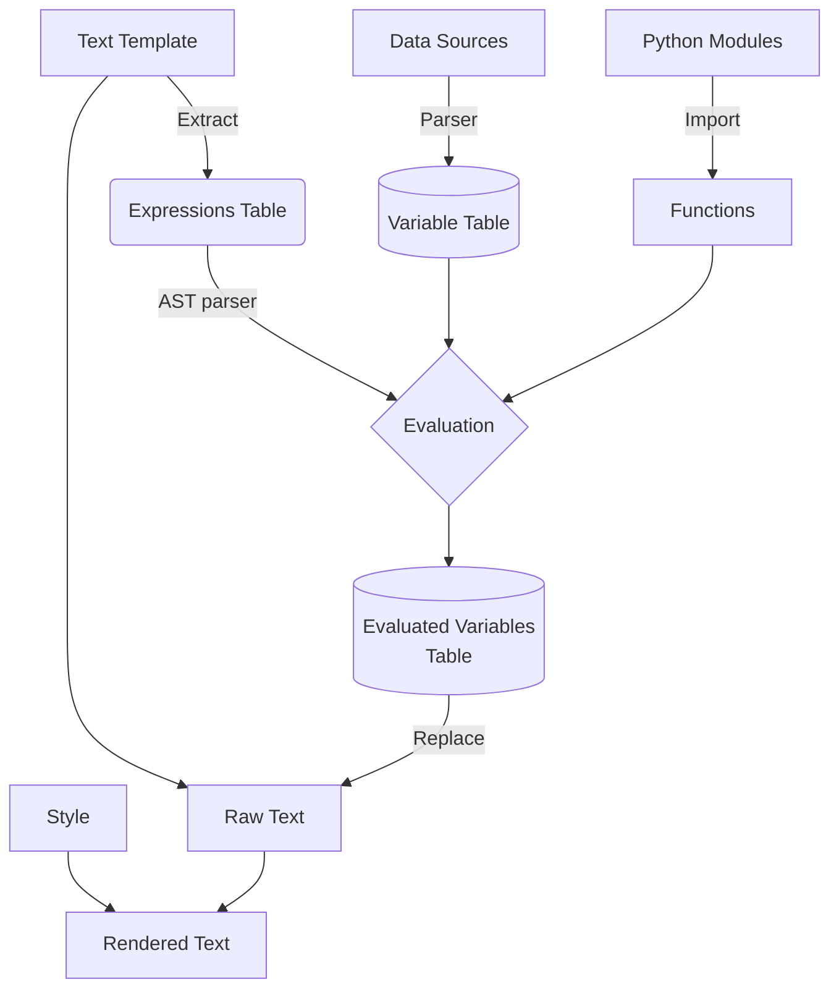

> [!NOTE]
> This document is a record of the conversation between me and
[GPT-4](https://openai.com/research/gpt-4) and [Claud
2](https://www.anthropic.com/index/claude-2).
The conversation might be edited for clarity and brevity but still interesting.

## Summary

Here is a summary of the template engine architecture and components we have mapped out so far:

**Data Flow**

- Data sources parsed into variable table
- Text template expressions extracted 
- Expressions parsed into ASTs
- ASTs evaluated using:
  - Variable table
  - Imported functions
- Evaluation outputs evaluated variables
- Text template renders raw text
- Raw text populated with evaluated variables
- Styling applied to raw text

**Components**

- **Data Sources:** SQL, MongoDB, JSON, etc.

- **Parser:** Extracts data into variable table using JSONPath 

- **Variable Table:** Holds extracted variables

- **Text Template:** Contains static text and expressions 

- **Expression Extraction:** Extracts expressions into table

- **AST Parser:** Parses expressions into AST objects

- **Evaluator:** Evaluates ASTs using variables and functions  

- **Functions:** Imported reusable Python functions

- **Evaluated Variables:** Output of expression evaluation

- **Raw Text:** Renders from text template 

- **Style:** JSON defining styling rules

- **Rendered Text:** Raw text styled and rendered

**Key Principles:**

- Separating concerns: data, text, logic, style
- Declarative extraction and mapping 
- Modular reusable functions
- Robust expression evaluation via ASTs



Let's recap what we have put together so far for the template engine architecture and components:

**Key Components**

- Template - JSON schema defining structure
- Variables - Extracted source data 
- Expressions - Dynamic placeholders like ${x}
- Functions - Reusable transformations 
- AST - Abstract syntax tree for evaluation
- Evaluator - Evaluates expressions and functions
- Renderer - Renders final output

**Template Definitions**

- Table - Columns schema + data source 
- Chart - Visual spec + data mappings

**Data Flow** 

- Sources parsed into variables
- Expressions parsed into ASTs 
- ASTs evaluated to give values
- Template rendered with values

**Backend**

- Data extraction 
- Expression evaluation
- API exposes evaluated data

**Frontend** 

- Calls API to get variables
- Renders visualizations 
- Applies interactivity

**Key Principles**

- Separation of concerns
- Declarative syntax
- Portable AST representations
- Reusable modular functions 
- Backend data processing
- Frontend presentation layer

Please let me know if I have accurately summarized the core aspects of the template engine design so far. I'm happy to clarify or expand on any part of the architecture, components, or workflows based on our discussions. Feedback is very welcomed!

Here is a draft article explaining the template engine architecture we have designed so far:

# Introducing the Declarative Data Templating Engine

As data volumes grow, there is an increasing need for automated and flexible reporting. Fixed dashboards and manual chart creation cannot keep up with rapidly changing data landscape. 

To address this, we have designed a new kind of templating engine that separates data, presentation, and logic into modular components. 

## Key Principles

The core principles driving the architecture are:

- **Declarative Over Imperative:** Templates are defined as JSON schemas without complex programming.

- **Separation of Concerns:** Data, presentation, styling, and logic are decoupled into standalone components.

- **Flexible Mapping:** Data variables can be mapped to templates with transformations applied dynamically. 

- **Modular Evaluation:** Business logic can be encapsulated into reusable Python modules and functions.

## Architecture Overview

At a high-level, the template engine workflow is:

1. **Ingest Data:** Extract data from sources into a standardized variable table.

2. **Define Template:** Create a JSON template schema describing desired visualizations.

3. **Transform Data:** Use expressions to reshape data to the template's needs. 

4. **Evaluate Template:** Parse expressions, evaluate against variables, output results.

5. **Render Visualizations:** Frontend consumes output data and renders interactive dashboards.

## Technical Deep Dive

Under the hood, the engine relies on several key technical innovations:

- **Robust Parsing:** Expressions are parsed into abstract syntax trees (AST) enabling complex evaluation.

- **Optimized Evaluation:** ASTs are efficiently evaluated against the variable table and reusable function modules.

- **Declarative Definitions**: Users describe desired outputs like charts, tables, and text - without imperative code. 

- **Standardized Outputs**: Processed data conforms to JSON schemas optimized for visualization. 

- **Separated Concerns**: Logic, presentation, data, and styling are compartmentalized for flexibility.

## Benefits

This architecture unlocks a number of benefits:

- **Agility**: Reports and dashboards can be adapted through templates rather than engineering efforts.

- **Modularity**: Each component from data to frontends can evolve independently. 

- **Scalability**: Template execution is horizontally scalable to handle large data volumes.

- **Iterability**: Rapid iterations on UX design without impacting data pipeline.

- **Reusability**: Common transformations encapsulated as reusable modules.

Here is an expanded version of the architecture overview section, going into more detail on each component and providing examples of what the templates may look like:

## Architecture Overview

The template engine workflow consists of the following key steps:

### 1. Ingest Data

The first step is ingesting data from various sources like databases, APIs, files, etc. into a standardized variable table. 

For example, data may be extracted from a SQL database into variables like:

```
users = DataFrame[id, name, email]
purchases = DataFrame[user_id, item, price] 
```

### 2. Define Template 

Next, a template schema is defined as a JSON document describing the desired visualizations.

For example, a template may define a chart and table:

```json
{
  "type": "report",
  "chart": {
    "type": "bar",
    "x": "${month}", 
    "y": "${revenue}"
  },
  "table": {
    "columns": [
      {"label": "Month", "field": "${month}"},
      {"label": "Revenue", "field": "${revenue}"} 
    ]
  }
}
```

This declares the output format but references `${expressions}` to be evaluated.

### 3. Transform Data

The template's expressions are then parsed into ASTs. Additional logic can be applied through imported Python modules and functions. 

These transformations reshape the ingested data variables into the structures needed for visualization. 

For example:

```python
pivot_table = pivot(users, purchases, "month", "revenue")
``` 

### 4. Evaluate Template

The ASTs are evaluated against the variables and function outputs. This populates the template with actual values, producing the final JSON output.

For the example template, the `${month}` and `${revenue}` expressions would be replaced with populated data arrays.

### 5. Render Visualizations

The frontend consumes the evaluated JSON output. It maps the populated template schemas into interactive visualizations.

Charts, tables, text etc. are rendered on-screen for the end user, applying styling and interactivity.

Since the template needs to be passed as a whole object through the API to the frontend, real-time updates would not be feasible without adding additional complexity.

Instead, the proper flow is:

- Template is evaluated fully on the backend 
- Results passed via API as complete JSON 
- Frontend renders visualizations from static JSON

To enable real-time updates, we'd need to consider approaches like:

- Breaking the template into smaller fragments that can be independently updated
- Websockets/streaming from backend to push incremental updates
- Periodic polling from frontend to refresh just portions of the data
- Rendering parts of the visualization on the backend and embedding in frontend

However, all of these add significant complexity. For many use cases, the simple flow of:

1. Backend evaluates template 
2. Renders complete output
3. Frontend visualizes 


I want to define something like rule based filtering/aggregating. However these rule should generate a python function (polars pipeline), we could add them into function/variable table (function IS variable), and produce a final result

That's an interesting requirement - using rules to generate Python functions that can transform and aggregate data. Here is one way that could be implemented:

- User defines a set of filter/aggregate rules in a declarative format like JSON. For example:

```
[
  {
    "type": "filter", 
    "conditions": {
      "col1": ">", 
      "value": 10 
    }
  },
  {  
    "type": "aggregate",
    "column": "col2",
    "agg": "SUM"  
  }
]
```

- These rules get parsed into an intermediate representation like an AST.

- A code generator module traverses the AST and emits corresponding Python code using a library like Polars. For the above:

```python
import polars as pl

df = pl.DataFrame(...) 

df = df.filter(pl.col("col1") > 10) 

df = df.aggregate([pl.col("col2").sum()])
```

- The generated Python function gets added to the function table.

- The template evaluator can then call this function, passing in a DataFrame.

- The function applies filtering/aggregation based on the defined rules.

- OutputDataFrame is added to variables table.

Benefits:

- Declarative rule definition syntax
- Rules translated to optimized Python code
- Enables complex data transformations
- Functions reusable in template

**Multiple Filters**

```json
[
  { "type": "filter", "col": "age", "op": ">", "val": 18},
  { "type": "filter", "col": "gender", "op": "==", "val": "M"} 
]
```

Generated function:

```python 
df = df.filter(pl.col("age") > 18).filter(pl.col("gender") == "M")
```

**Grouped Aggregation** 

```json
[
  {
    "type": "groupBy", 
    "cols": ["dept"]
  },
  {
    "type": "aggregate",
    "col": "salary",
    "agg": "AVG"
  }
]
```

Generated function:

```python
df = df.groupby("dept").aggregate([pl.col("salary").mean()])
```

**Multi-Column Aggregation**

```json
[
  {
    "type": "aggregate",
    "cols": {
      "sum_salary": {
        "col": "salary",
        "agg": "SUM"  
      },
      "avg_age": { 
        "col": "age",
        "agg": "AVG"
      }
    }
  }
] 
```

Generated function:

```python
df = df.aggregate([
  pl.col("salary").sum().alias("sum_salary"),
  pl.col("age").mean().alias("avg_age")
])
```


That sounds like a great idea! Here's a potential way to implement rule-based filtering/aggregating that generates a Python function (Polars pipeline) and integrates it into your existing template design:

1. **Rule Definition**: 

   Much like how you've defined variables and functions, you can also define rules in a similar manner. Each rule could be an object with a name, a source (which could be another function or variable), and a set of conditions or operations to apply. 

   You could use a domain-specific language (DSL) to express these rules in a way that's easy to write and understand. For example:

   ````jsonc
   {
     "name": "filtered_data",
     "source": "raw_data",
     "rules": [
       {
         "condition": "age > 18",
         "operation": "filter"
       },
       {
         "operation": "average",
         "field": "income"
       }
     ],
     "type": "Series[float]"
   }
   ```

2. **Rule Compilation**:

   You can then compile these rule definitions into actual Python functions. This could involve parsing the DSL, generating the corresponding Polars expressions, and wrapping them in a Python function.

   ````python
   def filtered_data(raw_data):
       return raw_data.filter(col('age') > 18).mean('income')
   ```

   This compilation step could be done ahead of time (statically) or at runtime, depending on your requirements.

3. **Function/Variable Table Integration**:

   Once you've compiled your rules into Python functions, you can add them to your function/variable table just like any other function or variable. They can then be used in the same way as other functions/variables in your template.

   ````jsonc
   {
     "name": "average_income_over_18",
     "source": {
       "function": "filtered_data",
       "variables": ["raw_data"]
     },
     "type": "float"
   }
   ```

4. **Result Generation**:

   Finally, you can use the functions generated from these rules to produce your final results. This could involve applying the functions to your data, aggregating the results, and formatting them for output.

This approach allows you to define complex data processing pipelines in a flexible and user-friendly way, while still leveraging the power of Polars and Python. It also integrates seamlessly with your existing template design.

Absolutely! I'll provide more examples using different types of data operations, and varying levels of complexity.

**Example 1 - Simple Filtering and Summation**

Suppose you want to filter out values below a certain threshold and then compute the sum. 

```jsonc
{
  "name": "sum_above_threshold",
  "source": "raw_data",
  "rules": [
    {
      "condition": "value > 10",
      "operation": "filter"
    },
    {
      "operation": "sum",
      "field": "value"
    }
  ],
  "type": "float"
}
```

This would translate to a Python function like this:

```python
def sum_above_threshold(raw_data):
    return raw_data.filter(col('value') > 10).sum('value')
```

**Example 2 - Grouping and Aggregation**

Suppose you have a DataFrame with sales data, and you want to calculate the total sales for each product category.

```jsonc
{
  "name": "total_sales_by_category",
  "source": "sales_data",
  "rules": [
    {
      "operation": "groupby",
      "field": "category"
    },
    {
      "operation": "sum",
      "field": "sales"
    }
  ],
  "type": "Series[float]"
}
```

This would translate to a Python function like this:

```python
def total_sales_by_category(sales_data):
    return sales_data.groupby('category').agg(pl.col('sales').sum())
```

**Example 3 - Complex Filtering and Aggregation**

Suppose you want to filter out certain rows based on multiple conditions, then group by a certain field, and finally compute the average of another field for each group.

```jsonc
{
  "name": "average_income_by_region",
  "source": "employee_data",
  "rules": [
    {
      "condition": "age >= 18 && job_status == 'FULL_TIME'",
      "operation": "filter"
    },
    {
      "operation": "groupby",
      "field": "region"
    },
    {
      "operation": "mean",
      "field": "income"
    }
  ],
  "type": "Series[float]"
}
```

This would translate to a Python function like this:

```python
def average_income_by_region(employee_data):
    return (employee_data
            .filter((pl.col('age') >= 18) & (pl.col('job_status') == 'FULL_TIME'))
            .groupby('region')
            .agg(pl.col('income').mean()))
```

These examples should give you a good idea of the flexibility this approach can provide. You can construct complex data processing pipelines by chaining together simple operations, and the user-friendly DSL makes it easy to define these pipelines.

I agree, the `left` and `right` terminology might not be the best choice for complex expressions or function calls. Instead, we could use a more flexible structure where each operation or function call is represented by an object with an `operation` or `function` field, and an `arguments` field that contains an array of arguments.

Here's how this could look:

**Function Call Example**

```jsonc
{
  "name": "calculate_tax",
  "source": "income_data",
  "rules": [
    {
      "operation": "apply",
      "arguments": [
        {
          "function": "tax_function",
          "arguments": ["income", "tax_rate"]
        }
      ]
    }
  ],
  "type": "Series[float]"
}
```

**Complex Condition Example**

```jsonc
{
  "name": "average_income_by_region",
  "source": "employee_data",
  "rules": [
    {
      "operation": "filter",
      "arguments": [
        {
          "function": "and",
          "arguments": [
            {
              "function": "gte",
              "arguments": ["age", 18]
            },
            {
              "function": "eq",
              "arguments": ["job_status", "FULL_TIME"]
            }
          ]
        }
      ]
    },
    {
      "operation": "groupby",
      "arguments": ["region"]
    },
    {
      "operation": "mean",
      "arguments": ["income"]
    }
  ],
  "type": "Series[float]"
}
```

In these examples, `tax_function`, `and`, `gte`, and `eq` are considered functions that take an arbitrary number of arguments (although in practice, `and` should take two or more arguments, `gte` and `eq` should take exactly two arguments). This makes the structure much more flexible and able to represent complex expressions and function calls.

The API manages templates stored as JSON files in a specific directory (referred to as `template-path` in your code). Here is a brief overview of how it works for each endpoint:

1. **`GET /template`** : This endpoint lists all the JSON templates in the `template-path` directory. It does this by listing all the files in the directory, filtering for JSON files, and then removing the file extensions before returning the list.

2. **`GET /template/:name`** : This endpoint retrieves a specific template by name. The name from the URL path parameter is used to construct the file path to the JSON file. If the file exists and is a JSON file, it is read and the content is returned. If the file doesn't exist or isn't a JSON file, an error is returned.

3. **`POST /template/:name`** : This endpoint creates a new template. The request body is expected to be a JSON object, which is written to a new file in the `template-path` directory. The file name is derived from the `:name` path parameter. If a file with the same name already exists, an error is returned.

4. **`DELETE /template/:name`** : This endpoint deletes a specific template. The `:name` path parameter is used to construct the file path to the JSON file. If the file exists and is a JSON file, it is deleted. If the file doesn't exist or isn't a JSON file, an error is returned.

The API doesn't seem to include any functionality for updating existing templates. If you need this functionality, you could add a `PUT /template/:name` endpoint that replaces an existing template with new content from the request body.

This API provides a simple and effective way to manage JSON templates as files on the filesystem. However, for more sophisticated use cases or larger scale applications, you might want to consider using a database to store your templates.
